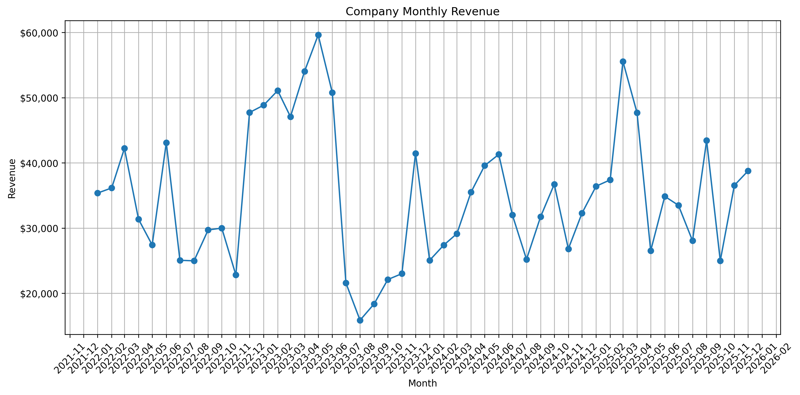
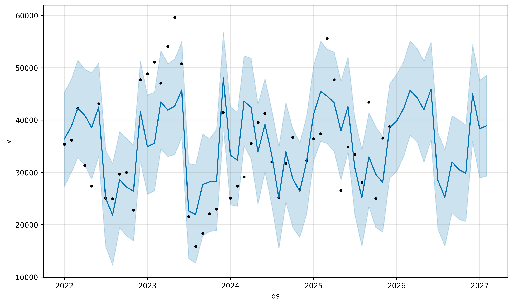
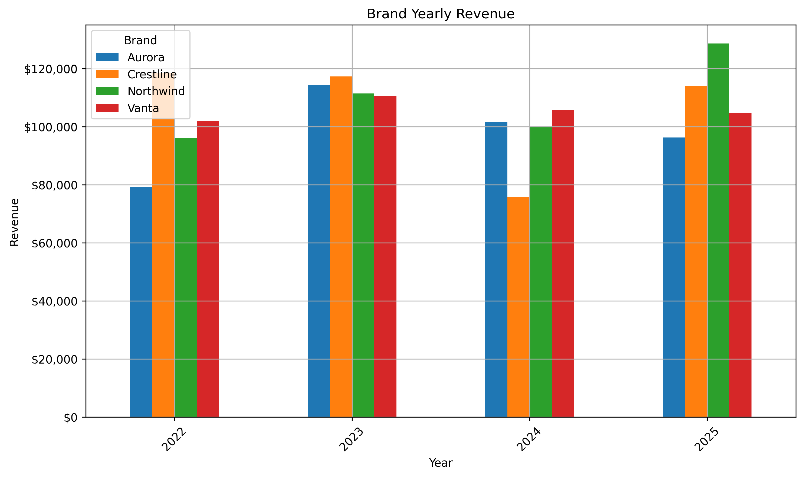
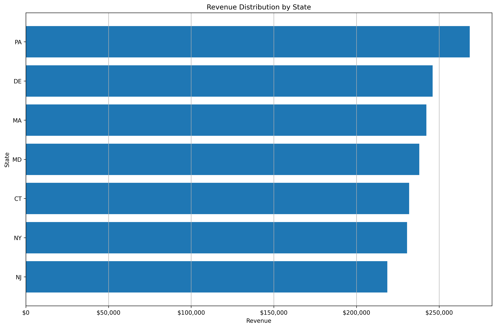

# Revenue Analytics & Forecasting System

A modular Python pipeline that turns raw sales-export data into aggregated
business views, ranked performance tables, a set of charts, and a
forward-looking revenue forecast.

I originally built this to augment manual Excel reporting at work, processing a
large NetSuite sales export (~310,000 rows) into the views below. **This public
version runs on a synthetic, randomly generated dataset that mirrors the real
export's structure — no real or proprietary company data is included.**

---

## What it does

The pipeline runs in clear stages:

1. **Load** the raw CSV export.
2. **Clean** — parse dates, normalise messy column names (`Amount (Tax)` →
   `Amount_Tax`), coerce money columns to numbers, and drop discount/rate-less
   rows.
3. **Split** rows into real *sales* vs. *damaged/lost* inventory so damage
   never inflates revenue.
4. **Aggregate** into **14 summary views** — revenue by brand, month, year,
   state, customer, and product category (plus quantity views).
5. **Rank** each view into top/bottom performer tables.
6. **Visualize** — generate a set of labelled charts (saved as PNGs).
7. **Forecast** — fit a [Prophet](https://facebook.github.io/prophet/)
   time-series model with yearly seasonality and project 14 months ahead.
8. **Save** a consolidated `results.txt` with the forecast, rankings, and
   grouped data.

## Tech stack

- **Python 3.11**
- **pandas / NumPy** — data cleaning and aggregation
- **Prophet** — time-series forecasting with seasonality
- **Matplotlib** — chart generation (headless / file output)

## Project structure

```
revenue-analytics-forecasting/
├── main.py                  # pipeline entry point
├── generate_sample_data.py  # creates the synthetic sample dataset
├── requirements.txt
├── src/
│   ├── config.py            # paths, column names, settings (no hard-coded data path)
│   ├── load_clean.py        # load + clean + split sales/damage
│   ├── aggregate.py         # the 14 grouped views
│   ├── analyze.py           # top/bottom ranking tables
│   ├── visualize.py         # chart generation
│   ├── forecast.py          # Prophet model + forecast plots
│   └── results.py           # writes results.txt
├── data/sample/             # synthetic sample CSV (safe to share)
├── outputs/                 # generated charts + results (git-ignored)
└── docs/sample_outputs/     # a few example charts for this README
```

## How to run

```bash
# 1. Set up the environment
python3.11 -m venv .venv
source .venv/bin/activate
pip install -r requirements.txt

# 2. Generate the synthetic sample dataset
python generate_sample_data.py

# 3. Run the pipeline
python main.py
```

Charts and `results.txt` are written to `outputs/`.

To run against a real export instead of the sample, point the pipeline at your
own file (and keep that file out of version control):

```bash
REVENUE_INPUT_CSV=/path/to/your_export.csv python main.py
```

## Sample outputs

*(Generated from the synthetic dataset — illustrative only.)*

| Monthly revenue | Revenue forecast |
|---|---|
|  |  |
| Brand yearly revenue | Revenue by state |
|  |  |

## Note on data privacy

The real dataset is my employer's proprietary sales data and is **not** included
in this repository. The committed `data/sample/sample_sales.csv` is fully
synthetic (see `generate_sample_data.py`) and exists only so the pipeline runs
end to end. `.gitignore` is configured to block real exports and credentials.
